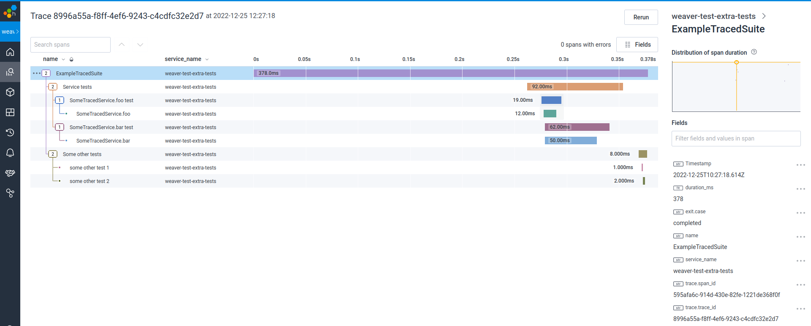

 [](https://codecov.io/gh/dimitarg/weaver-test-extra)
 


**Versions of this library prior to 0.5.0 work incorrectly and should not be used, see https://github.com/dimitarg/weaver-test-extra/pull/152**
# weaver-test-extra

> "Constraints liberate, liberties constrain." - Rúnar Bjarnason

Provides extra functionality to https://github.com/disneystreaming/weaver-test

Currently, the following functionality is provided

## package `weaver.pure`

Provides minimal, ready-to-use API to `weaver-test`, that does not perform side effects
in order to compute the tests in a test suite (i.e. "register" a test).


# Why this library exists

Registration of a test to be ran by vanilla `weaver-test` roughly takes the form:

```scala
def register(test: Test): Unit
```

If we instead assume that it's always the suite which assembles and returns the `fs2.Stream` of
tests to be ran, our test suite becomes a referentially transparent expression, and we can reap the benefits of that.

One very practical benefit of that is principled resource sharing and suite setup / teardown, which in a referentially transparent world are simply achieved via `Resource` / `Stream` and passing parameters to functions.

See also [this article](https://dimitarg.github.io/pure-testing-scala/) for a more verbose treatment of why purely functional testing is a good idea. 
*(The above article is outdated as it uses an old version of this library which had an unnecessarily complicated API, but the principles still apply.)*


# Getting started 

0. Obtain the current version number by looking for the latest [release](https://github.com/dimitarg/weaver-test-extra/tags) of this library

1. Add the following dependency to your build

```
"io.github.dimitarg"  %%  "weaver-test-extra"     % <latestVersion> % "test"
```

2. (Not specific to this library, this is a WeaverTest requirement). If you haven't already,
add the following to your project settings

```
    testFrameworks += new TestFramework("weaver.framework.CatsEffect")
```

# Base concepts

> This section explains the library design, motivation and implications. If you instead prefer to get started coding, feel free to skip this and jump to usage examples.


A pure test, i.e. a test that does not perform `IO`, is instantiated via:

```
def pureTest(name: String)(run: => Expectations)(implicit loc: SourceLocation): Test
```
, where `Test` is defined as

```scala
final case class Test(name: String, run: Expectations)
```

A test that performs `IO` is instantiated via

```scala
def test(name: String)(run: IO[Expectations])(implicit loc: SourceLocation): IO[Test]
```

Note the return type, `IO[Test]`.

A test suite is a runnable collection of tests and has type
```scala
def suitesStream: Stream[IO, Test]
```

To construct a suite runnable by `sbt` / `bsp` / `code`, extend `weaver.pure.Suite`:

```scala
object ExampleSuite extends Suite {

  override def suitesStream: Stream[IO, Test] = ???
}
```

Two convenience methods are provided to go from `List[IO[Test]]` to `Stream[IO, Test]`, running the tests in your suite either parallel, or sequentially.

```scala
  def parSuite(tests: List[IO[Test]]): Stream[IO, Test] = Stream.evals(tests.parTraverse(identity))

  def seqSuite(tests: List[IO[Test]]): Stream[IO, Test] = Stream.evals(tests.sequence)
```

## Implications 

All the above is to say, a test suite or its comprising tests can **only perform `IO` as part of their corresponding `Stream[IO, *]`**.

This is a deliberate design choice with positive and negative implications:

- Because `IO` is only ever performed as part of the surrounding stream, it is safe to provide test fixtures and resources inside the `Stream` scope, for example

```scala
Stream.resource(makeTestContainers).flatMap { containersUp =>
  yourSuitesStreamHere(contanersUp)
}
```

- Because suites have type `Stream[IO, Test]`, you can compose suites together, control parallelism, 
control test execution order, impose determinism of lack thereof, etc, via regular stream combinators, for example `parJoin`, `++`, `map`, `flatMap`, `evals` etc. That is to say, suite-level control flow and parallelism is achieved via reguar programming and you don't have to mess with test DSLs, build tool flags and such.

- On the downside, the expression type `Stream[IO, Test]` and the fact that `Test` by itself cannot perform `IO`, means that there is no separation between "constructing a suite" and "running tests". Said another way, we cannot compute the collection of tests to be ran separately from actually running the tests.
- Specifically, this means that filtering of tests inside a test suite **is not and cannot be supported in this library**. While test filtering is unsupported, it's still possible to filter across `Suite`s, via the standard `sbt` / `bsp` means.

## Should I be using this library?

In essence, what we've done here is we obtained the ability to perform test resource management and test suite composition via standard `fs2.Stream` means. In the process though, we have lost the ability to perform any static introspection of the test suite structure.

Both of these are due to admitting an extremely general type for test suite expressions: `Stream[IO, Test]`.

Whether you should be using this library boils down to whether you find principled resource management and suite composition more valuable than static suite introspection and suite filtering.

Lastly, this minimal library is just one point in the solution space. You may decide to explore this solution space on your own, for example by using the core premise of the library (test suites are expressions), but ascribing a less general type to a suite, to better suit your needs.


# Usage example

## Hello world

Here is a simple suite. You create one by extending `weaver.pure.Suite`:

```scala
package com.dimitarg.example

import java.time.Instant

import cats.effect.IO
import fs2.Stream
import weaver.pure._

object ExampleSuite extends Suite {

  override def suitesStream: Stream[IO, Test] = Stream(
    pureTest("a pure test") {
      val x = 1  
      expect(x == 1)
    },
    pureTest("another pure test") {
      val xs = List()
      expect(xs == List())
    }
  ) ++ Stream.eval(
    test("an effectful test") {
      for {
        now <- IO(Instant.now())
        _ <- IO(println(s"current time: $now"))
      } yield expect(1 == 1)
    }
  )
}
```

## Suite of tests that share a common resource

I.e. like `beforeAll`, but not hideous.

Since a suite (or sub-suite) of tests has type `Stream[IO, Test]`, and [sharing a resource is just passing a parameter](https://youtu.be/bCcEHRkFfbY?t=1946), a suite that uses some suite-wide "resource" of type `R` has type `R => Stream[IO, Test]`.

### Example

```scala
package com.dimitarg.example

import java.util.concurrent.Executors

import scala.concurrent.ExecutionContext

import cats.effect.{IO, Resource}
import fs2.Stream
import weaver.pure._

object ExampleResSuite extends Suite {

  // shared resource
  final case class TextFile(lines: List[String])

  // describe how to acquire shared resource
  val sharedResource: Resource[IO, TextFile] = for {
    ec <- Resource.make(
        IO(ExecutionContext.fromExecutorService(Executors.newCachedThreadPool()))
    )( x =>
        IO(x.shutdown)
    )
    xs = fs2.io.readInputStream(
        IO(getClass().getResourceAsStream("/foo.txt")),
        1024, closeAfterUse = true
    ) 
    lines <- Resource.eval(
        xs.through(fs2.text.utf8.decode).through(fs2.text.lines).compile.toList
    )
  } yield TextFile(lines)


  // suite which uses shared resource
  val suites: TextFile => Stream[IO, Test] = textFile => Stream(
    pureTest("the file has one line") {
      expect(textFile.lines.size == 1)
    },
    pureTest("the file has the expected content") {
      expect(textFile.lines == List("Hello, there!"))    
    }
  )

  // construct `suitesStream` by acquiring resource and passing that to your `suite` via `flatMap`
  override def suitesStream: Stream[IO, Test] =
    Stream.resource(sharedResource).flatMap { res =>
      suites(res)
    }
  
}
```

No magic!

## Using subsets of a shared resource across multiple modules

Imagine the following use case

- You have a module of database tests requiring, say `transactor: Transactor[IO]`
- You have a module of http integration tests requiring, say `client: Client[IO]`
- You have a module of end-to-end tests, requiring an access to a multitude of resources,
say
```scala
final case class TestResources(transactor: Transactor[IO], client: Client[IO], config: Config, ....)
```

Furthermore, you want to initialise the resources common to multiple test modules (in this example `Transactor[IO]` and `Client[IO]`) only once.

A way to achieve this in this example is to
- Construct a value `dbTests: Transactor[IO] => Stream[IO, Test]` for the database tests
- Construct a value `httpTests: Client[IO] => Stream[IO, Test]` for the http tests
- Construct a value `e2eTests: TestResources => Stream[IO, Test]` for the end to end tests
- Combine the resulting streams into a single stream with type `Stream[IO, Test]`,
by `flatMap`-ping over the shared resource, and providing the necessary resources to individual suites:


### Example

```scala
package com.dimitarg.example.sharedres

import cats.effect.{IO, Resource}
import fs2.Stream
import weaver.pure._

final case class FooResource()
final case class BarResource(value: Int)
final case class SharedResource(foo: FooResource, bar: BarResource)

object FooSuite {

  val all: FooResource => Stream[IO, Test] = foo => Stream(
    pureTest("the foo foos") {
        expect(foo == FooResource())
    }
  )
}

object BarSuite {
  val all: BarResource => Stream[IO, Test] = bar => Stream(
    pureTest("a barsuite test") {
      expect(bar.value == 42)
    }
  )
}

object ExampleSharedResSuite extends Suite {

  val mkSharedResource: Resource[IO, SharedResource] = for {
    _ <- Resource.eval(IO.pure(println("acquiring shared resource")))
    res <- Resource.eval(IO.pure(
      SharedResource(FooResource(), BarResource(42))
    ))
  } yield res

  val suiteUsingAllResources: SharedResource => Stream[IO, Test] = res => Stream(
    pureTest("some test"){
      expect(res.bar.value == 42)
  })

  override def suitesStream: Stream[IO, Test] =
    Stream.resource(mkSharedResource).flatMap { r =>
      suiteUsingAllResources(r) ++
      FooSuite.all(r.foo) ++
      BarSuite.all(r.bar)
    }
}
```

Notes:
- `FooSuite` and `BarSuite` do not need to extend anything from `weaver-test` or `weaver-test-extra`, they are just containers of `A => Stream[IO, Test]` values. This of course also means they would not be auto-discoverable or runnable on their own.

# Tracing

`weaver.pure.traced` supports test tracing via `natchez`. The example uses the honeycomb backend.

```scala
package com.dimitarg.example.traced

import scala.jdk.CollectionConverters._

import scala.concurrent.duration._
import cats.~>
import cats.arrow.FunctionK
import cats.data.ReaderT
import cats.implicits._
import cats.effect.{IO, Temporal, Resource}
import fs2._
import natchez.{Trace, Span}
import natchez.Trace.kleisliInstance

import weaver.pure._
import weaver.pure.traced._
import natchez.EntryPoint
import com.dimitarg.example.util.IntegrationTestConfig

object ExampleTracedSuite extends Suite {

    override def suitesStream: Stream[IO,Test] =
    Stream.resource(makeEntryPoint.flatMap(_.root("ExampleTracedSuite"))).flatMap { implicit rootSpan =>
      val service = SomeTracedService.apply[App]
      tracedParSuite("Service tests")(serviceTests(service)) ++
        tracedSeqSuite("Some other tests")(someOtherTests)
    }

  def serviceTests(service: SomeTracedService[App]): List[TracedTest] = List(
    tracedTest("SomeTracedService.foo test") { span =>
      service.translate(provideSpan(span)).foo
        .as(success) 
    },
    tracedTest("SomeTracedService.bar test") { span =>
      service.translate(provideSpan(span)).bar
        .as(success) 
    }
  )

  def someOtherTests: List[TracedTest] = List(
    tracedTest("some other test 1") { _ =>
      expect(1 === 1).pure[IO]
    },
    tracedTest("some other test 2") { span => 
      span.put("app.important.info" -> 42)
        .as(expect(2 === 2))
    }
  )

  private val makeEntryPoint: Resource[IO, EntryPoint[IO]] = for {
    testConfig <- Resource.eval(IntegrationTestConfig.load)
    result <- testConfig match {
      case IntegrationTestConfig.CI(hcKey) =>
        natchez.honeycomb.Honeycomb.entryPoint[IO](
          service = "weaver-test-extra-tests"
         ) { builder =>
          IO.delay {
            builder
              .setDataset("weaver-test-extra-tests")
              .setWriteKey(hcKey)
              .setGlobalFields(
                Map(
                  "service_name" -> "weaver-test-extra-tests",
                ).asJava
              )
              .build
          }
        }
      case IntegrationTestConfig.NotCI =>
        natchez.noop.NoopEntrypoint.apply[IO]().pure[Resource[IO, *]]
    }
  } yield result

  type App[A] = ReaderT[IO, Span[IO], A]

  def provideSpan(span: Span[IO]): App ~> IO = {
    def provide[A](x: App[A]): IO[A] = x.run(span)
    FunctionK.lift(provide)
  }

}

sealed trait SomeTracedService[F[_]] {
  val foo: F[Unit]
  val bar: F[Unit]

  def translate[G[_]](fg: F ~> G): SomeTracedService[G] = {
    val underlying = this

    new SomeTracedService[G] {

      override val foo: G[Unit] = fg(underlying.foo)

      override val bar: G[Unit] = fg(underlying.bar)
    }
  }
}

object SomeTracedService {
  def apply[F[_]: Trace: Temporal] = new SomeTracedService[F] {

    override val foo: F[Unit] = Trace[F].span("SomeTracedService.foo") {
      for {
        _ <- Temporal[F].sleep(10.millis)
      } yield ()
    }

    override val bar: F[Unit] = Trace[F].span("SomeTracedService.bar") {
      for {
        _ <- Temporal[F].sleep(50.millis)
      } yield ()
    }
  }
}
```

Example trace generated by this test:


